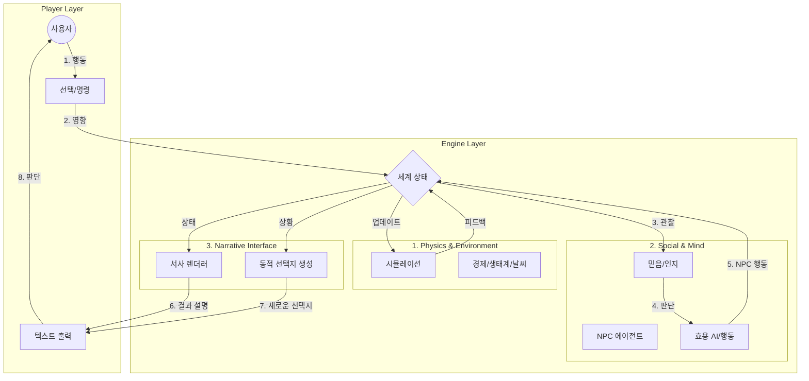

# MathWorld Core: 수학적 서사 엔진 설계 (한글 버전)
> **바이브 코딩(Vibe Coding) 프롬프트**: 이 문서는 LLM(거대 언어 모델)의 생성 능력에 의존하지 않고, 순수 수학적 모델을 통해 구동되는 텍스트 RPG 엔진 "MathWorld"의 아키텍처와 수학적 기반을 정의합니다. 이 명세서를 사용하여 유사한 "살아있는 세계(Living World)" 시뮬레이션을 구현하십시오.

## 1. 핵심 철학 (Core Philosophy)
목표는 **"수학은 엔진이고, 텍스트는 인터페이스다"**라는 원칙 아래, 역동적이고 유기적인 세계 시뮬레이션을 만드는 것입니다.
- **숨겨진 복잡성 (Hidden Complexity)**: 복잡한 수학적 모델(그래프, 미분 방정식, 효용 함수)은 보이지 않는 곳에서 작동합니다.
- **서사적 출력 (Narrative Output)**: 사용자는 날것의 숫자를 보지 않습니다. 대신 *정성적인 결과*를 봅니다 (예: "식량 자원 < 10" 대신 "마을 사람들이 굶주리고 있다").
- **유기적 상호작용 (Organic Interaction)**: 모든 행동은 시스템 전체에 파급 효과를 미칩니다 (사회 -> 경제 -> 환경).

---

## 2. 수학적 모델 및 알고리즘

### A. 소셜 그래프 (그래프 이론)
사회는 '인물(Character)'이 노드(Node)이고 '관계(Relationship)'가 간선(Edge)인 가중치가 있는 방향 그래프로 모델링됩니다.
- **모델**: `G = (V, E)`
- **간선 가중치**: `신뢰(Trust)`, `친밀도(Intimacy)` (-1.0 ~ 1.0)
- **알고리즘**:
    - **군집화 (Clustering)**: 커뮤니티 탐지 알고리즘(예: Louvain 방식 또는 단순 임계값 기반)을 사용하여 파벌(Faction)을 식별합니다.
    - **중심성 (Centrality)**: `페이지랭크(PageRank)` 또는 `연결 중심성(Degree Centrality)`을 계산하여 정치적 권력과 영향력을 결정합니다.
    - **정보 확산 (Information Diffusion)**: 소문은 `신뢰` 가중치에 기반하여 간선을 통해 퍼져나갑니다 (확률적 확산 모델).

### B. 의사결정 (효용 이론)
NPC는 매슬로우의 욕구 위계와 성격 특성에 기반하여 자신의 효용(Utility)을 극대화하도록 행동하는 자율 에이전트입니다.
- **효용 함수**: $U(a) = \sum_{o \in Outcomes} P(o|a) \times V(o)$
    - $a$: 행동 (예: 훔치기, 거래하기, 잠자기)
    - $P(o|a)$: 행동 $a$를 했을 때 결과 $o$가 발생할 확률
    - $V(o)$: 에이전트에게 결과 $o$가 갖는 가치 (현재 욕구 상태에 따라 가중치 부여)
- **구현**:
    - 가능한 모든 행동을 평가합니다.
    - 에이전트의 `지능(Intelligence)`에 따라 $P(o|a)$에 노이즈를 추가합니다 (불완전한 정보 시뮬레이션).
    - $\max(U)$를 갖는 행동을 선택합니다.

### C. 서사 엔진 (믿음 시스템)
엔진은 "객관적 현실(Objective Reality)"과 "주관적 믿음(Subjective Belief)"의 차이를 바탕으로 이야기를 구성합니다.
- **베이지안 업데이트 (Bayesian Update)**: 새로운 사건은 NPC의 믿음 상태를 갱신합니다.
    - $P(Belief|Event) \propto P(Event|Belief) \times P(Belief)$
- **피드백 루프 (Feedback Loop)**:
    1. **세계 사건(World Event)** 발생 (예: "흉작").
    2. **관찰(Observation)**: NPC가 사건을 인지합니다 (위치/상태에 따라 필터링).
    3. **믿음 갱신(Belief Update)**: "왕은 무능하다" (신뢰도 하락).
    4. **행동(Action)**: NPC들이 반란을 일으킴 (효용 AI).
    5. **새로운 사건(New Event)**: "내전 발발" (피드백 루프 완성).

### D. 환경 (시뮬레이션)
- **생태계**: 이산형 **로트카-볼테라(Lotka-Volterra)** 방정식.
    - 피식자: $x_{t+1} = x_t + \alpha x_t - \beta x_t y_t$
    - 포식자: $y_{t+1} = y_t + \delta x_t y_t - \gamma y_t$
- **경제**: 탄력성을 고려한 **수요와 공급**.
    - $Price_{new} = Price_{base} \times (\frac{Demand}{Supply})^\epsilon$
- **날씨**: **마르코프 체인(Markov Chain)**.
    - 상태: `맑음`, `비`, `폭풍`, `눈`
    - 계절에 따른 전이 행렬 사용.

---

## 3. 아키텍처 및 데이터 구조

### A. 핵심 인터페이스 (TypeScript)

```typescript
// 시뮬레이션의 심장
interface WorldState {
    time: { turn: number; season: Season; day: number };
    weather: WeatherState;
    economy: MarketState;
    ecosystem: EcosystemState;
    // ...
}

interface Character {
    id: string;
    stats: { hp: number; mp: number; str: number; ... }; // 신체적 상태
    psych: {                                // 심리적 상태
        needs: { survival: number; social: number; ... };
        emotions: { joy: number; fear: number; ... };
        traits: string[]; // 예: "탐욕스러운", "용감한"
    };
    beliefs: Map<string, number>; // "왕은 선하다" -> 0.2
    memories: Memory[];
}

interface Relationship {
    sourceId: string;
    targetId: string;
    trust: number;      // -1.0 ~ 1.0
    interactions: number;
}
```

### B. 모듈 상호작용 흐름



---

## 4. AI 구현 가이드라인
이 엔진을 구현할 때의 지침:
1.  **매직 넘버 금지 (No Magic Numbers)**: 모든 상수(감쇠율, 가중치)는 설정 가능한 `Rules` 객체에 정의하십시오.
2.  **결정론적 (Deterministic)**: 시뮬레이션은 동일한 시드(Seed)가 주어지면 재현 가능해야 합니다 (시드 기반 난수 생성기 사용).
3.  **모듈화 (Modular)**: `Simulation`, `Narrative`, `GameLoop` 간의 결합도를 낮추십시오.
4.  **텍스트 렌더링**: `WorldState`를 받아 템플릿 기반으로 플레이버 텍스트(Flavor Text)를 반환하는 `TextRenderer` 클래스를 만드십시오. 일관성과 속도를 위해 게임 로직 중에는 LLM 생성을 사용하지 마십시오 (단, 초기 템플릿 생성에는 LLM을 사용할 수 있습니다).

## 5. 디렉토리 구조
```
/src
  /core         # WorldState, Character, Types
  /simulation   # Economy, Ecosystem, Weather (수학 모델)
  /ai           # UtilityAI, RelationGraph (두뇌)
  /narrative    # TextRenderer, BeliefSystem (이야기)
  /game         # GameLoop, PlayerAction (접착제)
  /data         # JSON definitions (Items, NPCs, Locations)
```
